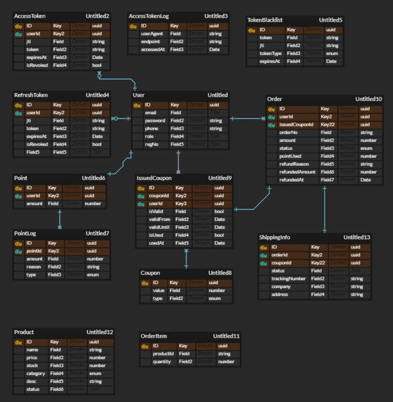
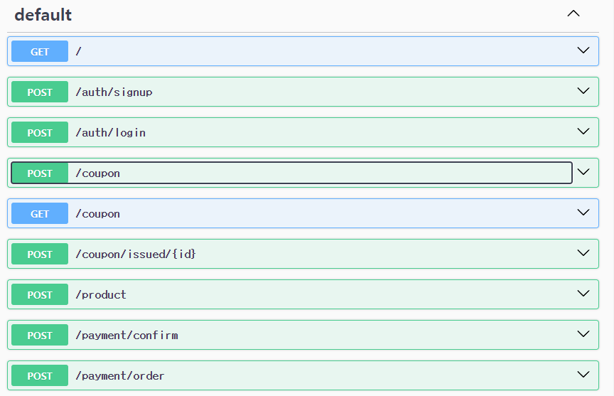

p<p align=center>

<h3> :blush:소개 </h3>
로그인 및 결제서비스<br>

주요 기능 : <br>

1. **로그인 및 회원가입**

- 회원가입 : 유저의 비밀번호는 argon2로 암호화해 회원가입합니다.
- 로그인 : 로그인 시 Access, Refresh 토큰을 발급합니다.
- RefreshToken : 로그인 시 만료되면 AccessToken을 재발급합니다.
- TokenBlackList : 만료된 토큰으로 로그인 시도를 할 경우 블랙리스트에 추가합니다.

2. **상품 주문**

- Coupon : 쿠폰, 이슈 쿠폰으로 나누어 쿠폰 발급 -> 쿠폰 등록 -> 쿠폰 사용이 가능합니다
- 포인트 충전 : 토스페이먼츠를 통해 포인트 충전이 가능합니다.
- 주문 : 로그인 후 productId, quantity를 입력하면 포인트를 조회 후 결제합니다.
- 주문 상태 : 유저는 주문 상태와 배송업체, 송장 번호를 확인 할 수 있습니다.

<h3>사용한 기술 스택<h3>


</p>

</p>

<h3>Api 명세<h3>
</p>
```
backend_material
├─ .eslintrc.js
├─ .prettierrc
├─ Dockerfile
├─ nest-cli.json
├─ package.json
├─ README.md
├─ src
│  ├─ app.controller.spec.ts
│  ├─ app.controller.ts
│  ├─ app.module.ts
│  ├─ app.service.ts
│  ├─ auth
│  │  ├─ auth.module.ts
│  │  ├─ controllers
│  │  │  ├─ auth.controller.ts
│  │  │  └─ index.ts
│  │  ├─ dto
│  │  │  ├─ create-user.dto.ts
│  │  │  ├─ index.ts
│  │  │  ├─ login-req.dto.ts
│  │  │  ├─ login-res.dto.ts
│  │  │  ├─ refresh-req.dto.ts
│  │  │  └─ signup-res.dto.ts
│  │  ├─ entities
│  │  │  ├─ access-log.entity.ts
│  │  │  ├─ access-token.entity.ts
│  │  │  ├─ index.ts
│  │  │  ├─ refresh-token.entity.ts
│  │  │  ├─ token-blacklist.entity.ts
│  │  │  └─ user.entity.ts
│  │  ├─ repositories
│  │  │  ├─ access-log.repository.ts
│  │  │  ├─ access-token.repository.ts
│  │  │  ├─ index.ts
│  │  │  ├─ refresh-token.repository.ts
│  │  │  ├─ token-blacklist.repository.ts
│  │  │  └─ user.repository.ts
│  │  ├─ services
│  │  │  ├─ auth.service.ts
│  │  │  ├─ index.ts
│  │  │  ├─ token-blacklist.ts
│  │  │  └─ user.service.ts
│  │  ├─ strategies
│  │  │  ├─ index.ts
│  │  │  └─ jwt.strategy.ts
│  │  └─ types
│  │     └─ index.ts
│  ├─ common
│  │  ├─ entity
│  │  │  ├─ base-entity.ts
│  │  │  └─ index.ts
│  │  └─ util
│  │     ├─ date-utils.ts
│  │     └─ index.ts
│  ├─ config
│  │  ├─ ormconfig.ts
│  │  └─ validation.schema.ts
│  ├─ exception
│  │  ├─ business.exception.filter.ts
│  │  ├─ business.exception.ts
│  │  └─ index.ts
│  ├─ interceptors
│  │  ├─ index.ts
│  │  └─ logging.interceptor.ts
│  ├─ main.ts
│  └─ payment
├─ test
│  ├─ app.e2e-spec.ts
│  └─ jest-e2e.json
├─ tsconfig.build.json
├─ tsconfig.json
└─ yarn.lock

```

<h4>결제 기능 구현하기<h4/>
-Point, Product, Coupon, Shipping, Order Entity 만들 예정<br>
-쿠폰, 상품을 선택 후 주문<br>
-주문 상태에서 결제 ( 결제 시 포인트 차감 / 트랜잭션 ) <br>
-결제 완료 시 주문 확인 <br>
-결제가 완료된 건의 상태 ( 발송, 배송완료 등 )를 판매자가 설정 가능하게 만들기<br>
<br>
쿠폰은 정액제( 5천원 등 금액 ), 정률제( 30% 등 )이 있을 예정 <br>
PG사 결제( 토스 )<br>
결제는 카테고리, 상품ID 등을 넣어 상품마다 할인이 가능하게 구현 예정
```
